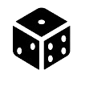

# Games-App

FORBEDRINGER I MIN KODE (Kun fokuseret på spiloversigten)

1. Tilføjet spin-hjulet og quizzen som nye måder at vælge spil på.
- Tilføjet 2 måder at vælge spil via enten et spin-hjul eller en quiz. De er lagt side om side i en wrapper (.spin-quiz-wrapper), og hver sektion har sin egen container (.spin-container / .quiz-container) med tekst og billede. Når brugeren klikker på spin-hjulet eller quiz-billedet, åbnes en pop-up dialog (<dialog id="spin-dialog"> / <dialog id="quiz-dialog">) med interaktivt indhold, som fyldes dynamisk via JavaScript. Spin-hjulet vælger et tilfældigt spil, mens quizzen guider brugeren gennem spørgsmål for at finde et passende spil. Knapper som “Spin igen”, “Tag quiz igen” og “Gå til spil” giver mulighed for at gentage eller gå videre, og både bokse og knapper har hover/fokus-effekter for bedre brugeroplevelse. Eksemplel på HTML ses nedenfor i eksempel 1.

Eksempel 1 fra index.html (linje 202-230):

<section>
  <h1>Kan du ikke vælge?</h1>
  

    

      

        

          <h2>Spin hjulet</h2>
          
Kan du ikke vælge hvilket spil I vil spille? Spin jer frem til næste spil!!

        

        

          
        

      

    

    

      

        

          <h2>Quiz dit spilvalg</h2>
          
Svar på få spørgsmål - så finder vi det perfekte spil til jer!!

        

        

          
        

      

    

  

</section>

2. Ændret farverne på ikonerne i bottombar
-  Sat røde/farver svg billeder ind på sider der ikke er "valgt" og sat et svg billede ind uden farve på den side der er "valgt" og som man er på. Som set på eksempel 1.

Eksempel 2 fra favoritside.html (linje 39-61):

<!-- Bottom Navigation Bar -->
    <nav class="bottom-nav">
      <a href="index.html" class="bottom-nav-item">
        

          
        

      </a>
      <a href="profilside.html" class="bottom-nav-item">
        

          
        

      </a>
      <a href="favoritside.html" class="bottom-nav-item bottom-nav-active">
        

          
        

      </a>
      <a href="burgermenu.html" class="bottom-nav-item">
        

          
        

      </a>
    </nav>

3. Ændret ikonerne på spillekortene og deres detaljeside
- Sat nye billeder ind, som er de rigtige, hvor alle er "f"illed" og fra samme familie. Ses i eksemplel 2 hvor billederne er sat ind.

4. Sat link til videoregler og en knap med "Vælg spil" nederst på detaljeside
- Tilføjet en class med "video-rules", en knap med "Vælg spil" og en class med "game-info", hvor dette kommer til at være på detaljesidenn på siden. Ses i eksempel 2.

5. Fået favoritknap på spillekort og detaljeside til at virke, så man kan markere hjerte til rødt. 
- Jeg har sat de rigtige billeder ind til favorit-fyldt-ikon og favorit-tomt-ikon. Koden tjekker automatisk, om et spil allerede er markeret som favorit. Hvis spillet er favorit, vises et fyldt hjerte, og hvis spillet ikke er favorit, vises et tomt hjerte. På den måde viser modal-vinduet for spillekort og detaljeside altid det korrekte ikon, afhængigt af hvad brugeren har valgt. Kan ses i eksempel 2, hvor de rigtige billeder for favorit er sat ind.

Eksempel 3 fra app.js (linje 1464-1493):

function buildGameModalHtml(game) {
  const favoriteIconSrc = isFavorite(game.title)
    ? "images/favorit-fyldt-ikon.png"
    : "images/favorit-tomt-ikon.png";
  return `
   

     
     
   

   

      <h1>${game.title} </h1>
      <h2 class="game-description">${game.description}</h2>
      
Hylde ${game.shelf}

      

        
 ${game.genre}
 
        
 ${game.rating}

        
 ${game.players.min}-${game.players.max} spillere

        
 ${game.playtime} minutter 

        
 ${game.age}+

        
 ${game.difficulty}

      

      
${game.rules}

    

    
 Videoregler 

    <button id="choose-game-button">Vælg spil</button>
    
Ved valg af spil har du mulighed for at holde øje med, 
    hvilke spil du har spillet, hvem du har spillet med, 
    resultater fra hvert spil og meget mere. Dette gælder kun hvis du er logget ind.

  `;
}

6. Sat søgefeltet i top nav inden i et søgeikon (billede af det)
- I HTML’en har jeg sat et billede ind af et søgeikon som virker som en knap. Søgefeltet bliver gemt i en "wrapper" (header-search-wrapper). Søgeikonet fungerer som en knap, der via JavaScript åbner og lukker selve søgefeltet ved at tilføje eller fjerne en CSS-klasse (open). På den måde vises søgefeltet først, når brugeren klikker på ikonet, hvilket giver et mere minimalistisk og mobilvenligt design. CSS’en styrer både udseendet af inputfeltet og transitionen, så det glider pænt frem, når det åbnes. HTML delen af dette ses i eksempel 4.

Eksempel 4 i index.html (28-45)

      <!-- Header sektion med søgefelt og filterknapper -->
      

        

          <!-- Knappen til at åbne og lukke søgefeltet -->
          <button id="search-toggle" class="search-toggle" aria-label="Åbn søgning">
            
          </button>

          <!-- Gemt søgefelt, som vises når brugeren klikker på søgeikonet -->
          

            <input
              type="text"
              id="header-search-input"
              placeholder="Søg spil..."        
              aria-label="Søg spil"
            />
          

        
